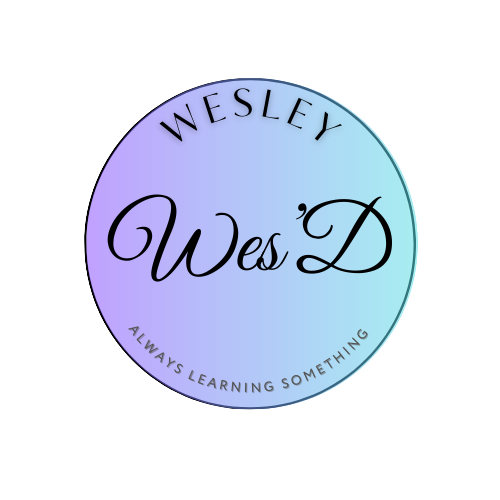
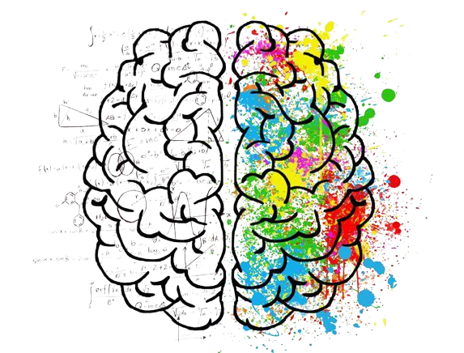
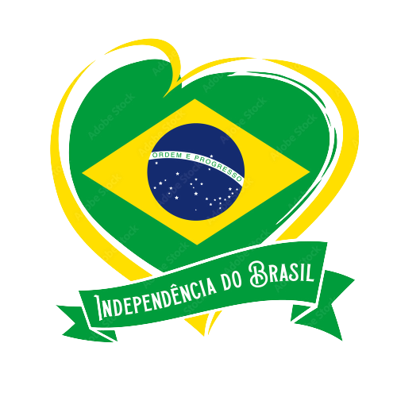

  <h1><a href="https://github.com/Wes-SNK">Wesley</a></h1>

Student of ADS (Analysis and Systems Development) and ADM (Administration) with experience in hardware and PC maintenance.
    
Administrative Server at Federal University of Ceara (UFC).

  ---
  > 🎭 _Eterno estudante de Teatro_ 🎭

## 
🌐Connect with me

  

    
    &#8287;&#8287;&#8287;&#8287;&#8287;&#8287;&#8287;&#8287;
    
    &#8287;&#8287;&#8287;&#8287;&#8287;&#8287;&#8287;&#8287;
    
  

   

  ## 
Hard Skills
  
  

    

      

        

          
          
          
          
          
          
          
          
          
        

      

    

  ## 
Soft Skills
 
  

  

  ### Communication
  - Effective verbal and written communication to convey ideas clearly.
  
  ### Problem Solving
  - Analytical thinking to identify and address complex issues.

  ### Creativity
  - Innovative thinking to develop new solutions and ideas.

  ### Teamwork
  - Collaborative skills for successful group efforts.

  ### Empathy
  - Understanding and relating to others' feelings and perspectives.

  ### Resilience
  - Ability to adapt and bounce back from challenges.

  ### Attention to Detail
  - Meticulousness in work to minimize errors.
  

 

## 
Languages

  

  

  -  Brasilian Portuguese
    - Native language
  -  English 
    - Fluent
    - Learned mostly through Games and TV Series
  -  Spanish
    - Intermediate
    - Comfortable in everyday conversations
  -  French
    - Basic
    - Learning and improving
  

 

## 
Projects

  

  
1. [ChatBot created as part of the Match! program in partnership between MasterTech and IBM](https://web.powerva.microsoft.com/environments/Default-b591ae54-33c2-4589-be66-9021a4196c7c/bots/cr9ee_projetoChatBot/canvas?__version__=2)

2. [AI-Powered Custom Message Generator for Simulated Bank Customers](https://gist.github.com/Wes-SNK/09d3272bf48343e7e0bcc23212a40f82), made on Santander's  Data Science Bootcamp 2023 with [DIO.](github.com/digitalinnovationone)

3. [PowerBI Analyst Challenge,](https://github.com/Wes-SNK/power_bi_analyst/blob/main/sales_report_desafio_projeto.pbix) made on Santander's  Data Science Bootcamp 2023 with [DIO.](github.com/digitalinnovationone)
 ([PDF Version](pdf/sales_report_desafio_projeto.pdf))

 

## 
GitHub Stats

<!---->

## 
Programming Languages

  

 
 
 

## 
Interests

  
;D

  - 🎮 Games
    - I'm an avid gamer, and I enjoy a wide range of video games, such as Resident Evil, Far Cry, DotA, Metal Gear Solid and many more.

- 🎭 Theater/Drama 🎭
  - I have a deep appreciation for the theater arts. I enjoy both watching and participating in live performances. Acting and storytelling through theater have always fascinated me. I'm usually an actor, director or lightning technician. [See my portfolio at Mapa Cultural do Ceará.](https://mapacultural.secult.ce.gov.br/agente/113606/)

- 💊 Matrix
  - The Matrix film series is a personal favorite of mine. I'm intrigued by its thought-provoking themes and futuristic concepts, which have sparked countless discussions and debates.
 
- 🛬 Lost
  - The best TV Show and so my favorite :)
    
- 🧙 Tolkien Universe 🧝‍♂️
  - I'm a passionate fan of J.R.R. Tolkien's works, including "The Lord of the Rings" and "The Hobbit." The rich mythology and intricate storytelling in Middle-earth captivate me.

- 🕵️ Sherlock Holmes
  - Sherlock Holmes has been a literary hero of mine. The deductive reasoning and mysteries in Arthur Conan Doyle's stories never fail to intrigue me.

- 👒 One Piece
  - One Piece is a beloved manga and anime series that I've been following for years. The adventures of Luffy and his crew are both thrilling and heartwarming, as well as its political and philosophycal implications.

- 👊 Martial Arts
  - I have a strong interest in martial arts and have been practicing Capoeira and Kung Fu for quite some time. It's not only a form of physical fitness but also a discipline that teaches focus and self-control.

 
 
 
 

---
> memento mori
<!---

  
<strong>Memento Mori</strong>

--->
